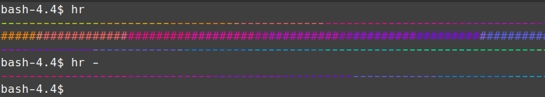

# hr
[](https://github.com/jakewarren/hr/blob/master/LICENSE)
[](https://goreportcard.com/report/github.com/jakewarren/hr)
[](http://makeapullrequest.com)

> generate horizontal rule (hr) for terminals

## Install

```
go get github.com/jakewarren/hr/...
```

## Usage
### As a CLI

### As a library

```golang
package main

import (
	"fmt"

	"github.com/jakewarren/hr"
)

func main() {
	fmt.Println(hr.HorizontalRule("-"))
}

```

## Acknowledgements

Heavily based on [sashka/hr](https://github.com/sashka/hr).  
Format specification adapted from [LuRsT/hr](https://github.com/LuRsT/hr).  

## License

MIT © 2019 Jake Warren
